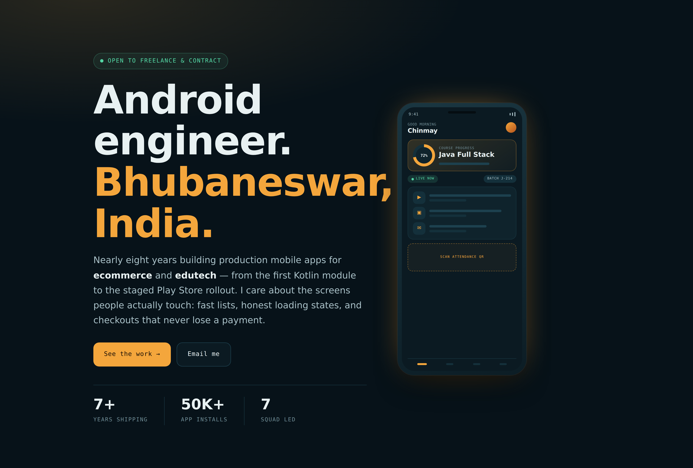
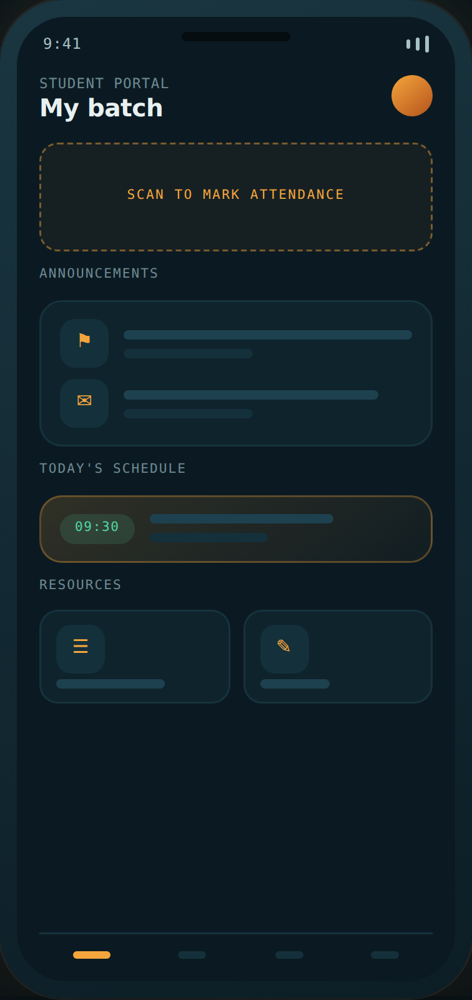
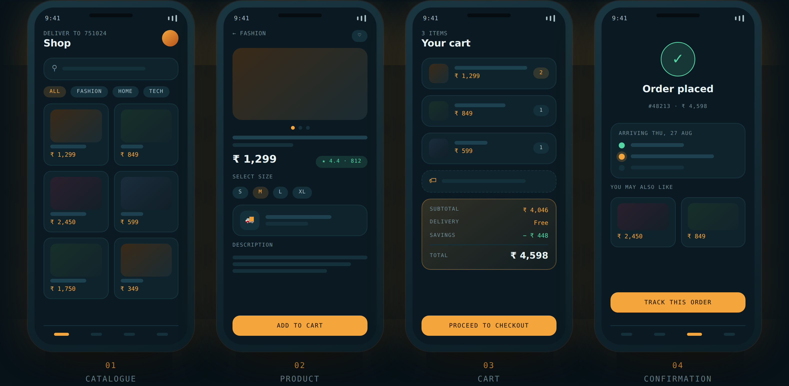
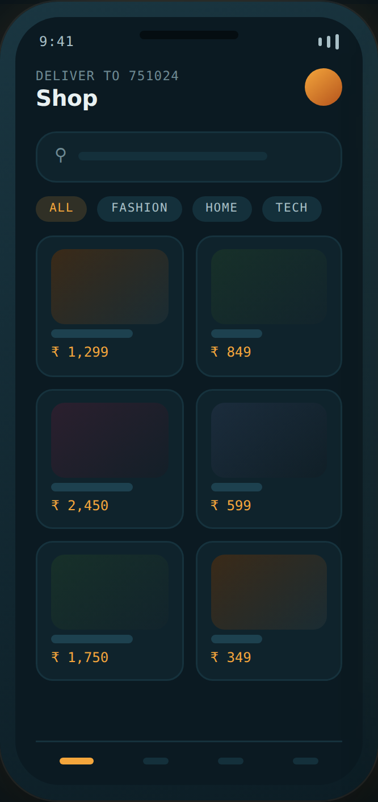
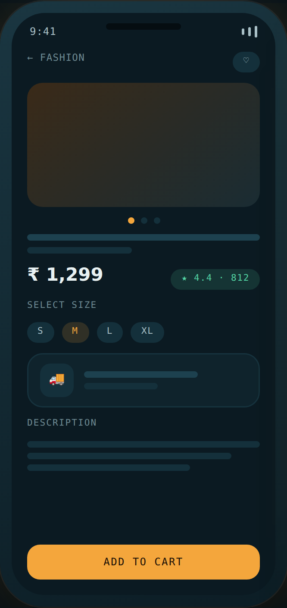
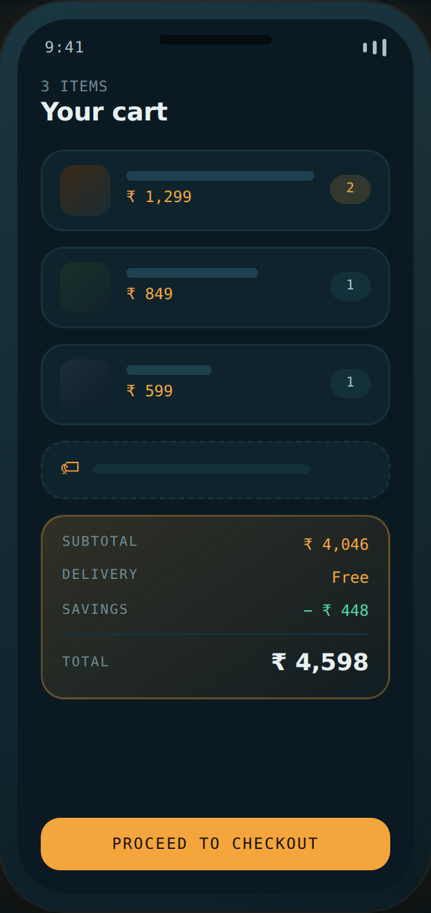
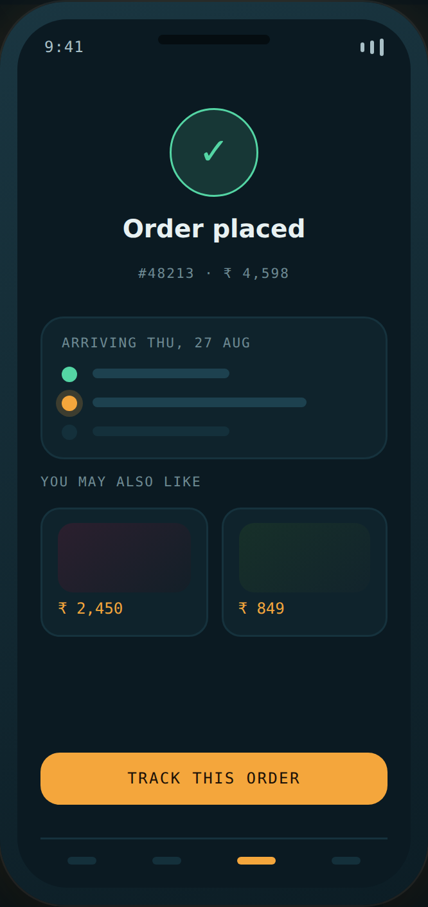
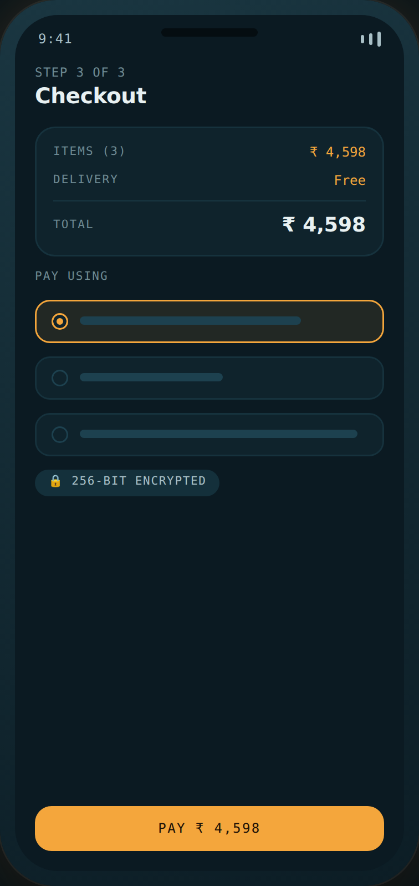
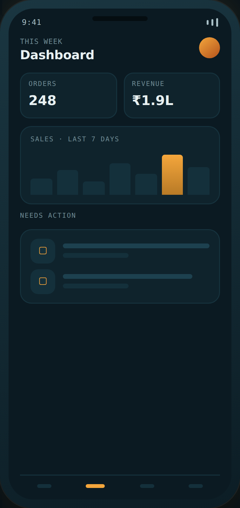
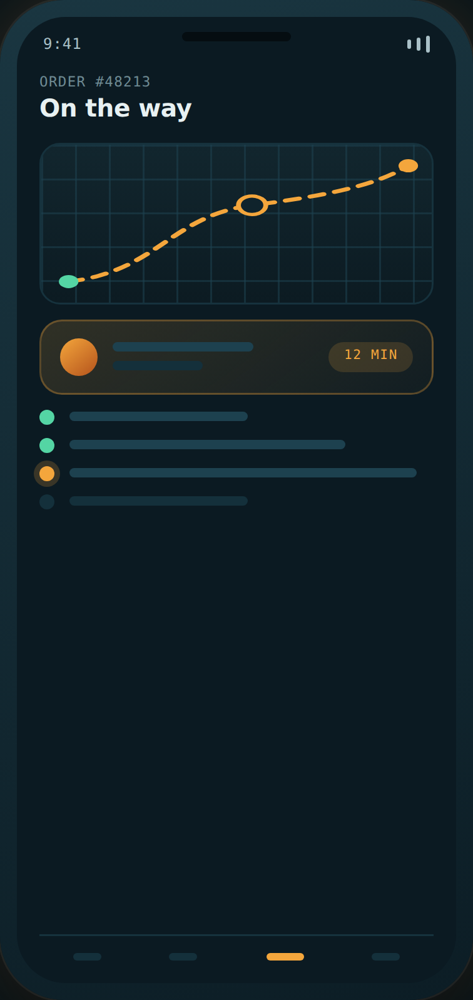

<p align="center">
  
</p>

<h1 align="center">Chinmay Moharana</h1>

<p align="center">
  <strong>Android &amp; Mobile Application Engineer</strong><br>
  Bhubaneswar, Odisha, India
</p>

<p align="center">
  <a href="https://chinmay4github1987.github.io/portfolio_global/">Portfolio</a> ·
  <a href="https://www.linkedin.com/in/chinmay-moharana-6290b193">LinkedIn</a> ·
  <a href="mailto:chinmaymoharana2011@gmail.com">Email</a> ·
  <a href="https://play.google.com/store/apps/details?id=com.qsp.student&hl=en_IN">Google Play</a>
</p>

<p align="center">
  
  
  
  
  
  
</p>

---

## About

Nearly eight years building production mobile apps for **ecommerce** and **edutech** — from the first Kotlin module to the staged Play Store rollout.

I care about the screens people actually touch: fast lists, honest loading states, and checkouts that never lose a payment. Day to day that means Kotlin and Java against a Jetpack stack — MVVM, Coroutines and Flow, Room for offline, Retrofit at the edges — working from design handoff through release and owning the crash dashboard afterwards.

| | |
|---|---|
| **Currently** | Software Engineer, Test Yantra Software Solutions (Bangalore) |
| **Based in** | Bhubaneswar, Odisha · IST · remote-friendly |
| **Domains** | Ecommerce, edutech, payments |
| **Freelance** | Available |

---

## Career

| Period | Role | Company |
|---|---|---|
| **Oct 2021 — Present** | Software Engineer | Test Yantra Software Solutions, Bangalore |
| Mar 2021 — Oct 2021 | Android Developer | LightWave Digital Networks, Bhubaneswar |
| Aug 2020 — Jan 2021 | Android Developer | PixelKare Solutions, Bhubaneswar |
| Dec 2019 — Jul 2020 | Android Developer | iCertGlobal, Bangalore |
| Sep 2018 — Dec 2019 | Android Developer | TKM Softech, Bangalore |

### Software Engineer — Test Yantra Software Solutions
`Oct 2021 — Present · Bangalore`

- Own Android delivery for the company's education platform — architecture, implementation and Play Store releases for an app serving **50,000+ enrolled students**.
- Coordinate a cross-functional squad of seven across Android, backend, QA and design; run estimation, code review and release sign-off.
- Migrated legacy Java screens to **Kotlin + MVVM** on Jetpack (Navigation, Room, WorkManager, Coroutines/Flow), cutting duplicated view logic across modules.
- Built secure transaction flows: tokenised payment gateway integration, encrypted local storage, certificate-pinned API traffic.
- Reduced cold-start time and ANR rate through layout flattening, R8 tuning and systematic Crashlytics triage each release cycle.
- Set up Gradle build variants and staged rollouts so regressions are caught at 5% before reaching the full install base.

### Android Developer — LightWave Digital Networks
`Mar 2021 — Oct 2021 · Bhubaneswar`

- Built customer-facing Android features straight from Adobe XD handoff.
- Integrated REST services with Retrofit and Coroutines, with an offline cache for poor connections.
- Shipped push notification and deep-link handling with FCM.

### Android Developer — PixelKare Solutions
`Aug 2020 — Jan 2021 · Bhubaneswar`

- Delivered several client Android apps in parallel across separate codebases and release schedules.
- Refactored screens onto MVP/MVVM patterns and Material Components.
- Handled Play Store release management end to end — signing, listings, staged updates, post-release monitoring.

### Android Developer — iCertGlobal
`Dec 2019 — Jul 2020 · Bangalore`

- Built the course catalogue, video lesson playback and in-app purchase flow for a professional training platform.
- Built list-heavy screens with RecyclerView and custom adapters in Java.

### Android Developer — TKM Softech
`Sep 2018 — Dec 2019 · Bangalore`

- Where my Android career started — built and maintained client applications in Java with XML layouts.
- Learned the release path end to end, from project setup in Android Studio to a signed APK on the Play Store.
- Worked across list screens, forms and REST integration, with SQLite handling local persistence.
- Fixed bugs against real device reports, which taught me more about Android fragmentation than any tutorial did.

---

## Selected work

### 1. Q / J / Py / Pro Spiders — Student App



**Edutech · Android · [Live on Google Play](https://play.google.com/store/apps/details?id=com.qsp.student&hl=en_IN)**

The student portal for QSpiders, JSpiders, PySpiders and ProSpiders learners, built at Test Yantra. Students scan a QR to mark attendance, receive administrator notifications, and reach their batch resources from one home screen.

My work covered the Android client: screen architecture, the QR capture path across light and dark themes, notification routing, and the release train that keeps 50,000+ installs on a current build.

`Kotlin` `CameraX / ML Kit` `FCM` `Room` `Material 3`

**50,000+** installs · **Education** category

<br clear="right">

### 2. Ecommerce app — browse to buy

**Ecommerce · Android**

The shopper-facing half of a retail app, built as one flow rather than a set of screens. A paginated catalogue that stays smooth under fast scrolling, a product page that keeps variant state through rotation, a cart backed by Room so it survives a killed process, and an order confirmation driven by the server's real state. Search results and recently viewed items cache locally, so reopening the app costs nothing.



| | | | |
|:--:|:--:|:--:|:--:|
|  |  |  |  |
| **01** Catalogue | **02** Product | **03** Cart | **04** Confirmation |

`Kotlin` `MVVM` `Paging 3` `Glide` `Room` `Coroutines` `Material 3`

### 3. Secure checkout flow



**Payments · Android**

Cart to confirmation, built to be boring in the best way. Payment gateway integration with tokenised cards, UPI intent handling, and an idempotent order call so a flaky network never charges twice.

Sensitive values stay in the Android Keystore, API traffic is certificate-pinned, and every failure state has a screen that tells the customer what actually happened.

`Kotlin` `Payment SDK` `Keystore` `Cert pinning` `Retrofit`

<br clear="right">

### 4. Seller dashboard



**Ecommerce · Android**

The merchant-side app: order queue, inventory edits and a sales chart that reads at a glance on a phone held one-handed.

Built around a single source of truth in Room so a seller can update stock on a patchy connection and have it sync when signal returns, with WorkManager retrying quietly in the background.

`Kotlin` `WorkManager` `Room` `Flow` `MPAndroidChart`

<br clear="right">

### 5. Live order tracking



**Logistics · Android**

Real-time delivery tracking with a map view, an animated route and a status timeline that mirrors the backend state machine exactly — no optimistic guesses.

Location updates are batched and throttled to keep battery drain low, and the whole screen degrades to a readable timeline when the map cannot load.

`Kotlin` `Maps SDK` `Fused Location` `WebSocket` `Foreground service`

<br clear="right">

---

## Toolkit

**Core — daily**
`Android SDK` `Kotlin` `Java` `MVVM` `Coroutines & Flow` `Jetpack Navigation` `Room` `Retrofit` `Material 3` `Gradle`

**Working knowledge**
`Jetpack Compose` `Hilt / Dagger` `WorkManager` `Firebase` `Crashlytics` `Play Console` `Git` `Postman` `Figma` `Adobe XD`

**Cross-platform &amp; web**
`Flutter` `React Native` `PHP` `HTML` `CSS` `REST APIs`

**Currently learning**
`AI` `Machine learning` `RAG` `LLMs` `LangChain` `Python` `MongoDB` `Cyber security` `Kotlin Multiplatform`

---

## Education

**B.Tech, Electrical &amp; Electronics Engineering**
Padmanava College of Engineering, Rourkela, Odisha · 2006 — 2010

---

## Freelance

| | |
|---|---|
| **Ship a new Android app** | Design file to signed release — architecture, implementation, Play Store listing and the first staged rollouts, with a codebase your team can pick up afterwards. |
| **Rescue an existing one** | Crash triage, cold-start and jank profiling, Java-to-Kotlin migration, and untangling Activities that grew into everything. |
| **Payments &amp; secure flows** | Gateway integration, tokenised checkout, Keystore-backed storage and certificate pinning. |

---

## This repository

The source of [chinmay4github1987.github.io/portfolio_global](https://chinmay4github1987.github.io/portfolio_global/) — a single, dependency-free `index.html`. No build step, no framework, no bundler.

```
index.html        the whole site (HTML + CSS + a little JS)
contact-form.gs   Google Apps Script backend for the contact form
assets/           project mockups and section captures used in this README
.nojekyll         tells GitHub Pages to serve the files as-is
```

### Contact form

GitHub Pages only serves static files, so the form talks to two free backends. Both are optional — with neither configured the form still works, falling back to opening the visitor's mail app with the message ready to send.

Open `index.html`, find the `CONTACT` block near the bottom, and fill in what you want:

```js
var CONTACT = {
  APPS_SCRIPT_URL: '',   // Google Sheet database + email from your own Gmail
  WEB3FORMS_KEY:   '',   // delivery straight to your inbox
  TO_EMAIL:        'chinmaymoharana2011@gmail.com'
};
```

**1 · Google Sheet + Gmail (the database).** Every submission becomes a row in a sheet you own, and the script emails you the details.

1. Go to [sheets.new](https://sheets.new) and name it, e.g. *Portfolio enquiries*.
2. **Extensions → Apps Script**, delete the placeholder, paste in all of `contact-form.gs`, save.
3. **Deploy → New deployment → Web app.** Execute as **Me**, Who has access **Anyone**.
4. Authorize it — the "unverified app" warning is your own script; **Advanced → Go to …**.
5. Copy the Web app URL (it ends in `/exec`) into `APPS_SCRIPT_URL`.

Run `testSubmission` from the Apps Script editor to confirm a row appears and the email arrives. After editing the script, redeploy as a **New version** or the live URL keeps serving the old code.

**2 · Web3Forms (the fallback).** Grab a free access key at [web3forms.com](https://web3forms.com) using your Gmail address and paste it into `WEB3FORMS_KEY`. Every message is mirrored to your inbox, and it takes over if the Apps Script call ever fails.

The form validates inline, has a honeypot field that silently swallows bot submissions, and never stores anything in the browser.

### Publishing it

1. Create a repository named **`portfolio_global`**.
2. Push these files to the `main` branch.
3. **Settings → Pages → Source: Deploy from a branch → `main` / `root`.**
4. The site goes live at `https://chinmay4github1987.github.io/portfolio_global/` in a minute or two.

```bash
git init
git add .
git commit -m "Portfolio site"
git branch -M main
git remote add origin https://github.com/chinmay4github1987/portfolio_global.git
git push -u origin main
```

To use it as a **profile README** instead, create a repository named `chinmay4github1987` and put this `README.md` at its root — it then renders on your GitHub profile page.

---

<p align="center">
  <a href="mailto:chinmaymoharana2011@gmail.com"><strong>chinmaymoharana2011@gmail.com</strong></a> · +91 82498 66956
</p>
